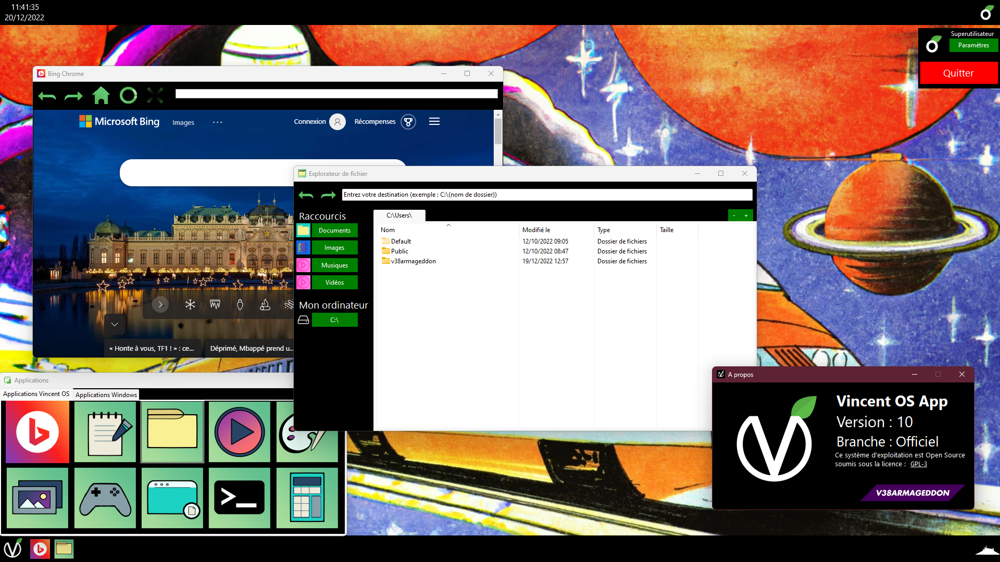

#  Welcome to Vincent OS App!
Ce projet consiste à créer un mini système d'exploitation dans mes temps perdus.

## Installation

### Recommended Installation
The best way to get Vincent OS is to download from the Microsoft Store.

### Alternate Installation
If you don't want to use the Microsoft Store, you can download the file: 
> Vincent OS App Setup.exe

When opening the Setup, choose the "Install for all users" option.

### Standalone Installation
You can download the Setup file and choose the "Install just for me" option.

### Manual Installation
#### Requirements
- Windows 10 / 11
- Visual Studio 2022 Community
- .NET 8.0 SDK

#### Build
#### Visual Studio
1. Clone the repository
2. Open the "Vincent OS App.sln" solution file.
3. Press "F5" to build and run the project.
4. Done!

#### ``dotnet`` CLI
1. Clone the repository
2. Open a terminal and go to "src".
3. Run ``dotnet build "Vincent OS App.sln"``.
4. Done!