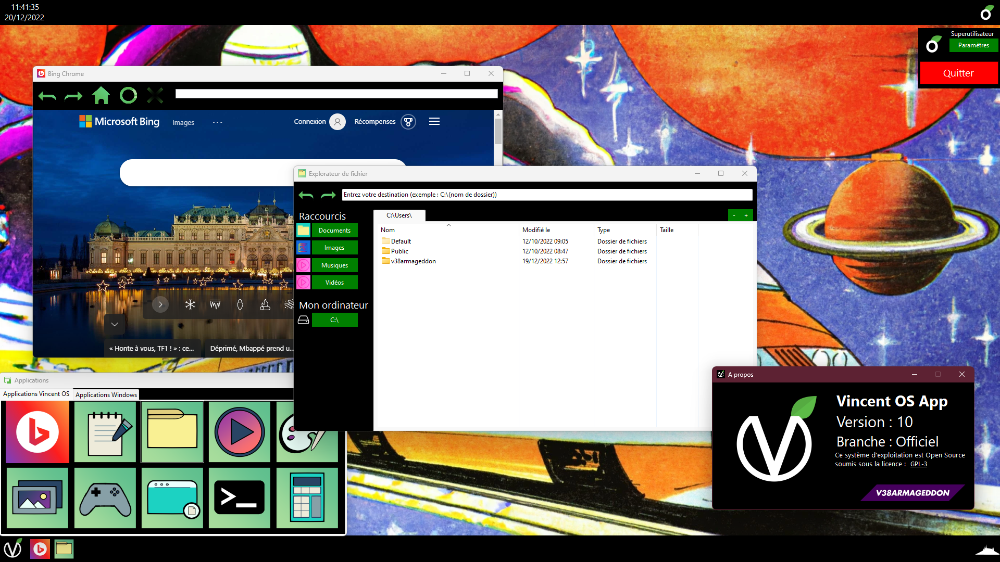

# Vincent OS App
Vincent OS App is a Uno Platform software hub for the operating system: Vincent OS.

<!---->

## Installation
### Windows
You can download the Vincent OS App on the Microsoft Store.

<a href="ms-windows-store://pdp/?productid=9PGNSPX24L00s">
  
</a>

If you prefer to not use the Microsoft Store, you can download a installer in the Release page.

### Linux
Depending on your distribution you can install Vincent OS App via different methods.

#### Vincent OS
Vincent OS repository include all versions of Vincent OS App, you can install it via the following command:
```bash
pacman -S vincent-os-app
```

#### Flatpak
For other versions, you can install the flatpak version:
```bash
# Add our Flatpak repostiory
flatpak remote-add --if-not-exists v38armageddon https://repo.v38armageddon.net/flatpak/v38armageddon.flatpakrepo
flatpak install net.v38armageddon.VincentOSApp
```

### Build from source
#### Visual Studio 2026
You need to have the [Uno Platform extension](https://marketplace.visualstudio.com/items?itemName=unoplatform.uno-platform-addin-2022) installed on your IDE.
1. Open ``Vincent.OS.App.slnx``
2. Press F5
3. That's it!

#### dotnet CLI
1. Run ``dotnet build ./Vincent.OS.App.slnx``
2. That's it!

----

## Contributions
Vincent OS App is open to all contributions! You can read more at the CONTRIBUTE.md file.
