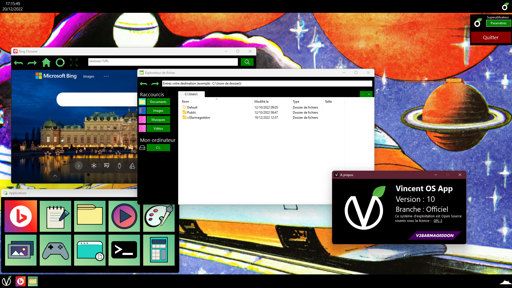

#  Welcome to Vincent OS App!
This project involves creating a mini operating system in my spare time.

## Installation
### Windows
#### Recommended Installation
The best way to get Vincent OS App is to download from the Microsoft Store.

#### Alternate Installation
If you don't want to use the Microsoft Store, you can download the file: 
> Vincent OS App Setup.exe

When opening the Setup, choose the "Install for all users" option.

#### Standalone Installation
You can download the Setup file and choose the "Install just for me" option.

--------------------------
### Linux
#### Recommended Installation
The best way to get Vincent OS App is to download from Flathub.

<!--Insert here Flatpak icon when published-->

#### Standalone Installation
You can download the file:
> Vincent OS App Linux.zip

Extract the zip file to a localization and launch the ``Vincent.OS.App`` executable.

--------------------------
## Build from Source
### Requirements
- Windows 10 / 11
- Visual Studio 2022 Community
- .NET 8.0 SDK
- Uno Platform extension

### Visual Studio
1. Clone the repository
2. Open the "Vincent OS App.sln" solution file.
3. Press "F5" to build and run the project.
4. Done!

### ``dotnet`` CLI
1. Clone the repository
2. Open a terminal and go to "src".
3. Run ``dotnet build "Vincent.OS.App.sln"``.
4. Done!
